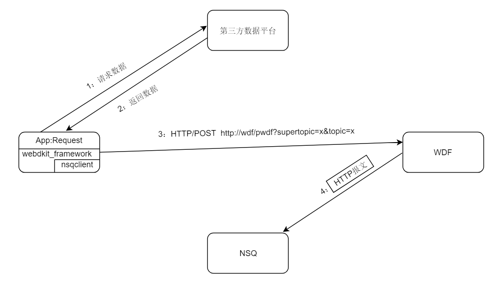

# 1. webdkit 简介

webdkit是用python开发的框架，用来简化业务与WDF，NSQ以及第三方应用数据平台之间复杂的交互流程，使得开发人员专注于自己业务逻辑，无需在上述交互流程花费太多精力，只专注数据生产/消费逻辑处理。另外，webdkit框架也实现了数据检查，行协议转换以及dataway数据发送等功能。


# 2. webdkit 使用场景

webdkit使用场景中涉及到如下组件：
- WDF：提供HTTP服务；
- NSQ：数据暂存，中转或转发；
- 第三方数据平台：应用数据来源；
- App：使用webdkit框架开发的应用程序。


使用场景分为两类：
- 主动型：周期性地主动向第三方平台请求数据，数据经过消费后再写入dataway；
- 被动型：在经过第三方平台认证后，被动收到数据，经过数据消费后再写入dataway。

### 主动型

- 数据获取：


- 数据消费：


### 被动型


- 认证流程：


- 数据获取：


- 数据消费：


### 主/被动型异同
- 相同点：
	
	1. WDF同一个http服务url；
	2. WDF存入NSQ中都是HTTP报文；


- 不同点：
	1. 虽然http服务url地址相同，但查询参数有差异；
	2. 主动型框架传给业务消费逻辑是HTTP Body，而被动型框架传给业务消费逻辑是完整的HTTP报文。原则是：框架收到什么数据，最终传给业务逻辑就是原样的数据。

这样实现优点是：框架逻辑简单，而且很容易通过url参数实现消息的分发。


### supertopic/topic
前述流程中存在`supertopic`与`topic`，由于pynsq库只能阻塞侦听一个topic，而框架需要侦听多个topic，所以定义了一个`supertopic`，用来封装多个topic，即WDF向NSQ发送消息都是用`supertopic`，而子topic存在于消息中（HTTP报文header中url查询参数），每个webdkit应用都是侦听`supertopic`。通常每个应用最好配置独一无二的super_topic，每个应用中的topic不要重名，不同应用间topic重名则没有影响。


# 3. webdkit 安装

把安装包`webdkit-0.0.1-py3-none-any.whl`下载到本地，进入到安装包所在目录，执行如下命令即可完成webdkit与其依赖包安装。
> pip install webdkit-0.0.1-py3-none-any.whl


# 4. webdkit 源文件

webdkit主要源文件及功能如下：
- check.py，数据有效性检查；
- decorator.py，装饰器`Request`，`Response`，`Auth`与`UnAuth`；
- framework.py，框架主要逻辑，nsq队列侦听，多线程管理，认证状态管理与消息分发等；
- line_protocol.py，行协议转换；
- transmit.py，数据发送。

和业务开发直接相关的是`decorator.py`与`framework.py`。使用webdkit简化业务开发工作：首先需继承`decorator.py`源文件中`WdkBase`类；其次还需`decorator.py`文件中提供的装饰器配合。


# 5. webdkit 装饰器

`decorator.py`文件共有如下几种类型装饰器，虽然被装饰的方法命名没有约束限制，可以按照需要自由的命名，但是对方法的参数会有所限制。

- Request(topic, interval)，用于装饰周期性从第三方平台获取数据方法，
	- 装饰器参数：`topic`：字符串类型，表示话题名，`interval`：整数类型，表示获取数据的间隔，单位为秒；
	- 方法参数：被装饰方法的参数无限制；
	- 方法返回值：使用此装饰器的方法在无数据时返回`None`，否则返回获取的有效数据(byte类型)。


- Response(topic)，用于装饰消费数据方法，
	- 装饰器参数：`topic`：字符串类型，表示消费数据话题名；
	- 方法参数：使用此装饰器的方法签名为`xxx(self, data)`,`data`：byte类型，表示待处理的数据
	- 方法返回值：需返回诸如`[point1, point2, point3,...]`列表，列表每个元素`point`代表一个写入influxdb的数据点，每个数据点将会被转成行协议并发送到dataway，若没有数据点则返回空列表`[]`。每个`point`是诸如`{"measurement":"xxx", "tags":tag, "fields":field, "timestamp":1585293365730598912}`字典类型，其中：`xxx`标集名；`tag`数据点的tag，字典类型，tag可选；`field`数据点的field，字典类型，field必填；`1585293365730598912`纳秒级别整数时间戳，可选，若不填框架自动打上当前时间；框架会检查每个数据点类型是否正确，若类型检查失败，则丢弃数据并产生`ERROR`级别打印信息；


- Auth(topic)，用于装饰第三方平台认证方法，
	- 装饰器参数：`topic`：字符串类型，表示话题名；
	- 方法参数：使用此装饰器的方法签名为`xxx(self, data, auth_stage)`，`data`：字节类型，表示待需要处理的验证数据，`auth_stage`：整数类型，表示框架维护的认证阶段，从数字0开始依次递增，业务根据需要在不同阶段处理不同的验证数据；
	- 方法返回值：法返回值为`(confirm_data, is_finish)`元组，confirm_data为处理后认证数据（byte类型），is_finish为`bool`类型，表示认证是否结束，`True`结束，`False`未结束。


注意：通过`topic`名把`Request`，`Response`与`Auth`关联起来，即：一个`topic`最多只能有一个`Response`，`Request`与`Auth`只能两者有其一。`Request`与`Response`可以配合使用，`Response`与`Auth`也可配合使用，但`Request`与`Auth`在同一个`topic`名下不可配合使用，这样也无实际意义。当然，若一个`topic`仅仅有`Response`也是合理的。


# 6. webdkit 示例

每个`WdkBase`子类中可以定义多个topic，每个topic可以是`Request`与`Response`组合，或`Auth`与`Response`组合，根据业务需要灵活实现。

### Request/Response

以5秒为周期获取驻云gitlab上ftagent项目ft-2.0分支commit信息并进行消费为例：

```
class ZhuyunGitlab(WdkBase):
    @Request(topic="gitlab_ft-2.0_commit", interval=5)
    def request_gitlab_ft-2.0_commit(self):      
        param = {}
        param["private_token"] = self.cfg["gitlab"]["token"]  # 获取配置文件中gitlab token信息
        r = requests.get(url="https://gitlab.jiagouyun.com/api/v4/projects/333/repository/commits/ft-2.0", params=param)
        return r.content # 返回获取到数据，json格式

    @Response(topic="gitlab_ft-2.0_commit")
    def response_gitlab_ft-2.0_commit(self, data):
        points = []
        d = json.loads(data.decode()) # json解析

        fields = {}    # field填充
        fields["id"] = d["id"]
        fields["created_at"] = d["created_at"]
        fields["message"] = d["message"]

        tags = {}      # tag填充
        tags["title"] = d["title"]
        tags["author_name"] = d["author_name"]
        tags["author_email"] = d["author_email"]
        tags["project_id"] = str(d["project_id"])

        p = {}         # point构造
        p["measurement"] = "gitlab_ft_20_commit"
        p["tags"] =tags
        p["fields"] = fields
        points.append(p)

        return points
```

### Auth/Response
以钉钉注册为例。

```
import random
import requests
import json
from dingtalk.crypto import DingTalkCrypto
from webdkit.framework import WdkBase
from webdkit.decorator import Request, Response, Auth, UnAuth

class DingTalk(WdkBase):
    def __init__(self):
        self.token = "123456"
        self.corp_id = "ding756c3a3731cc4d7c"
        self.app_key = "dingevjpdegyhmfvvzmx"
        self.app_secret = "-sF4tzkZ9dE17owMcYINj34_HJQf4eViUuzT9aZbRfbYjUpIU7ZzPAt9dQjK4OL6"
        self.access_token = self.get_access_token()
        self.ads_encoding_key = self.gen_ads_encoding_key()
        self.crypto = DingTalkCrypto(self.token, self.ads_encoding_key, self.corp_id)

    def gen_ads_encoding_key(self):
        char_set = "abcdefghijklmnopqrstuvwxyzABCDEFGHIJKLMNOPQRSTUVWXYZ0123456789"
        letters = [random.choice(char_set) for _ in range(43)]
        return "".join(letters)

    def get_access_token(self):
        request = requests.get("https://oapi.dingtalk.com/gettoken?appkey={}&appsecret={}".format(self.app_key, self.app_secret))
        return request.json()["access_token"]

    def reg_ding_callback(self):
        headers = {"Content-Type": "application/json"}
        data = {}
        data['call_back_tag'] = ['bpms_task_change']
        data['token'] = self.token
        data['aes_key'] = self.ads_encoding_key
        data['url'] = self.get_url("bpms_task_change")

        json_data = json.dumps(data)
        url = "https://oapi.dingtalk.com/call_back/register_call_back?access_token={}".format(self.access_token)
        req = requests.post(url=url, data=json_data, headers=headers)
        print("---------------------------stage 0----------------------------")
        print(req.text)

    def ding_talk_confrim(self, data):
        print("---------------------------stage 1----------------------------")
        http_content = data.decode().split("\r\n")
        http_first = http_content[0]
        url = http_first.split()[1]
        params = url.split("?")[1].split("&")
        params = {p.split("=")[0]: p.split("=")[1] for p in params}

        signature = params["signature"]
        timestamp = params["timestamp"]
        nonce = params["nonce"]
        encrypt = http_content[-1]

        json_decryp = self.crypto.decrypt_message(msg=encrypt, signature=signature, timestamp=timestamp, nonce=nonce)
        decryp = json.loads(json_decryp)
        print(decryp)
        event = decryp.get("EventType", "")
        if event != "check_url":
            return None, False

        confirm_data = self.crypto.encrypt_message(msg="success")
        print("............................Finish auth.............................\n{}".format(confirm_data))
        return json.dumps(confirm_data).encode(), True

    @Auth(topic="bpms_task_change")
    def ding_talk_auth(self, data, auth_stage):
        if auth_stage == 0:
            self.reg_ding_callback()
            return None, False
        elif auth_stage == 1:
            return self.ding_talk_confrim(data)

    @Response(topic="bpms_task_change")
    def ding_talk_process(self, data):
        print("---------------------------process----------------------------")
        http_content = data.decode().split("\r\n")
        http_first = http_content[0]
        url = http_first.split()[1]
        params = url.split("?")[1].split("&")
        params = {p.split("=")[0]: p.split("=")[1] for p in params}

        signature = params["signature"]
        timestamp = params["timestamp"]
        nonce = params["nonce"]
        encrypt = http_content[-1]

        json_decryp = self.crypto.decrypt_message(msg=encrypt, signature=signature, timestamp=timestamp, nonce=nonce)
        decryp = json.loads(json_decryp)
        points = []
        pt = {}
        tags = {}
        tags["corpId"] = decryp["corpId"]
        tags["EventType"] = decryp["EventType"]
        tags["title"] = decryp["title"]
        tags["type"] = decryp["type"]
        fields = {}
        fields["processInstanceId"] = decryp["processInstanceId"]
        fields["businessId"] = decryp["businessId"]
        fields["processCode"] = decryp["processCode"]
        fields["bizCategoryId"] = decryp["bizCategoryId"]
        fields["staffId"] = decryp["staffId"]
        fields["taskId"] = decryp["taskId"]
        pt["measurement"] = "bpms_task_change"
        pt["tags"] = tags
        pt["fields"] = fields
        points.append(pt)
        return points

    @UnAuth(topic="bpms_task_change")
    def unauth(self):
        r = requests.get(url="https://oapi.dingtalk.com/call_back/delete_call_back?access_token={}".format(
            "7b902c128f203d9aa8972fb996f2d34a"))
        print(r.text)
        return True
```

# 7. webdkit 启动
以开启一个DingDing应用为例，写好业务逻辑后，先`init("配置文件名")`进行初始化操作，再执行`run()`启动。

```
class DingDing(WdkBase):
	@Request(topic="xxx", interval=x)
    def get_data(self):
        # 获取数据逻辑实现

    @Response(topic="xxx")
    def pro_data(self, data):
		# 处理数据逻辑实现
        
d = DingDing()          # 创建应用实例
d.init("webdkit.conf")  # 加载配置文件及初始化
d.run()                 # 开启应用
```

# 8. webdkit 配置

webdkit配置文件如下，可以在配置文件中增加业务自定义配置项，比如gitlab配置节点信息。代码中通过`self.cfg`获取配置信息，是一个多级嵌套字典，例如`self.cfg["gitlab"]["token"]`获取gitlab节点下token配置数据。

另外，框架不会主动创建nsq相关的`super_channel`与`super_topic`，需由用户自己创建。

```
[wdf]
host="http://127.0.0.1:8080/"                     # wdf HTTP服务地址

[dataway]
url="http://10.100.64.106:19528/v1/write/metrics" # dataway数据接收地址
batch_size = 5                                    # batch_size个数据点打包成一个HTTP Post请求
flush_time = 60                                   # 发送缓冲区时间，单位秒
pk = "afffff"                                     #  dataway公钥
ak = "aaabbb"                                     #  dataway私钥

[nsq]
super_topic = "abc"                               # 超级topic名
super_channel = "abc_process"                     # 超级topic监听channel名
lookupd_http_addr = "127.0.0.1:4161"              # nsq lookupd http地址

[log]
log_file = ""                                     # log文件名，若为空字符串则log输出到终端
log_level = "debug"                               # log级别，支持有debug，info，error，critical，且不区分大小写

[gitlab]
token="KovnP_TmLX_VTmPcSzYq"                      # 某业务新增自定义配置项
```